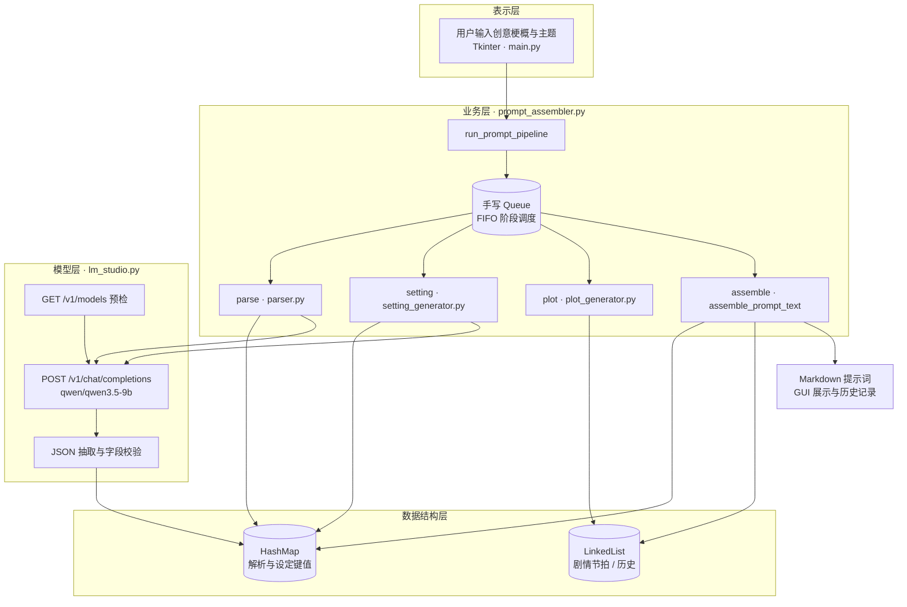
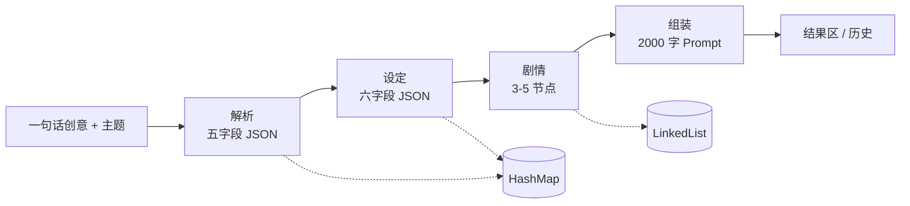
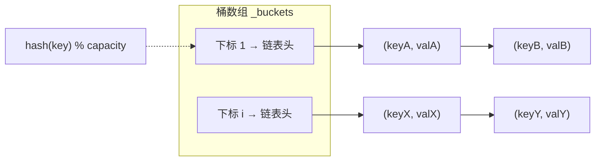

# 小说提示词 AI 生成器 — 系统架构图

> 基于项目报告与源码整理。可在支持 Mermaid 的编辑器中预览。

## 图1 系统总体架构

## 图2 四阶段流水线数据流

## 图3 HashMap 链地址法示意

## 模块对照

| 层级 | 模块 | 职责 |
|:---|:---|:---|
| 表示层 | `main.py` | 主题选择、输入、结果展示、历史 |
| 业务层 | `parser.py` | 创意 → 五字段 JSON |
| 业务层 | `setting_generator.py` | 主题化六字段设定 |
| 业务层 | `plot_generator.py` | 剧情节拍生成 |
| 业务层 | `prompt_assembler.py` | 队列调度与文本组装 |
| 数据结构层 | `hash_map.py` / `linked_list.py` / `my_queue.py` | 键值存储、顺序存储、FIFO |
| 模型层 | `lm_studio.py` | HTTP 调用与 JSON 抽取 |
