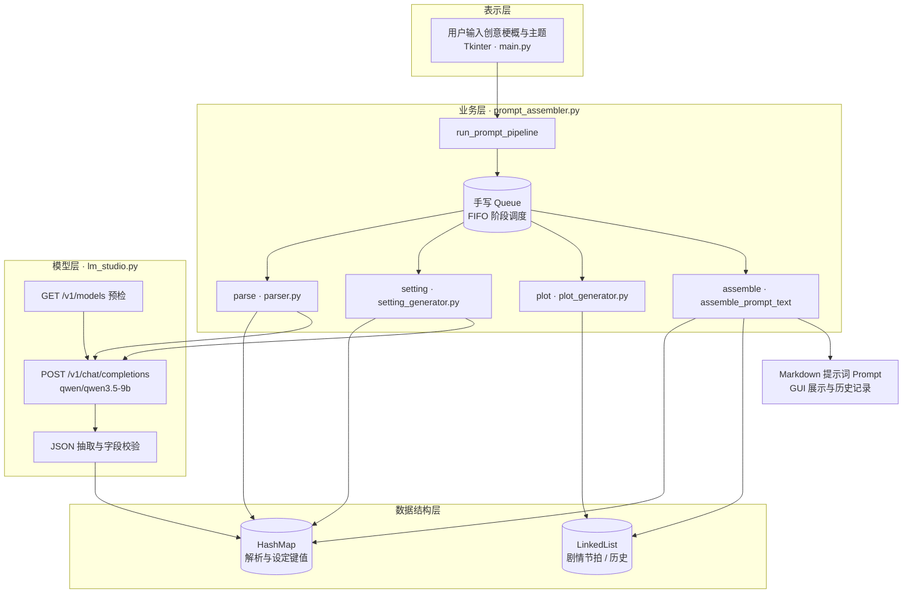
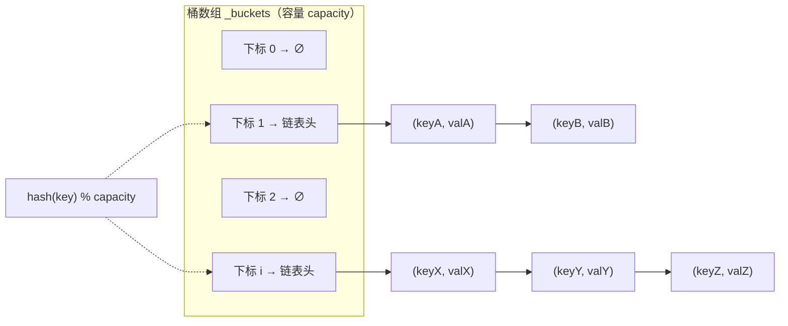
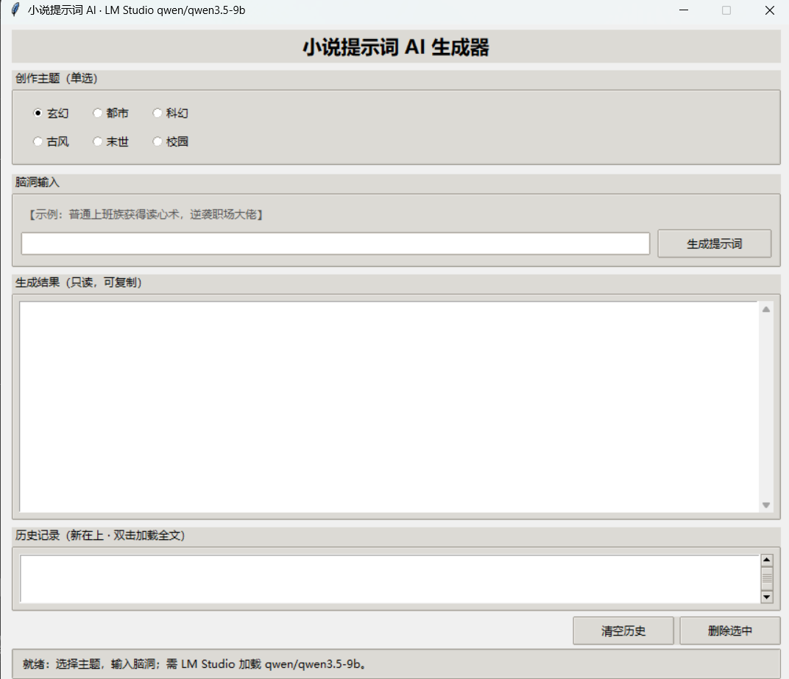
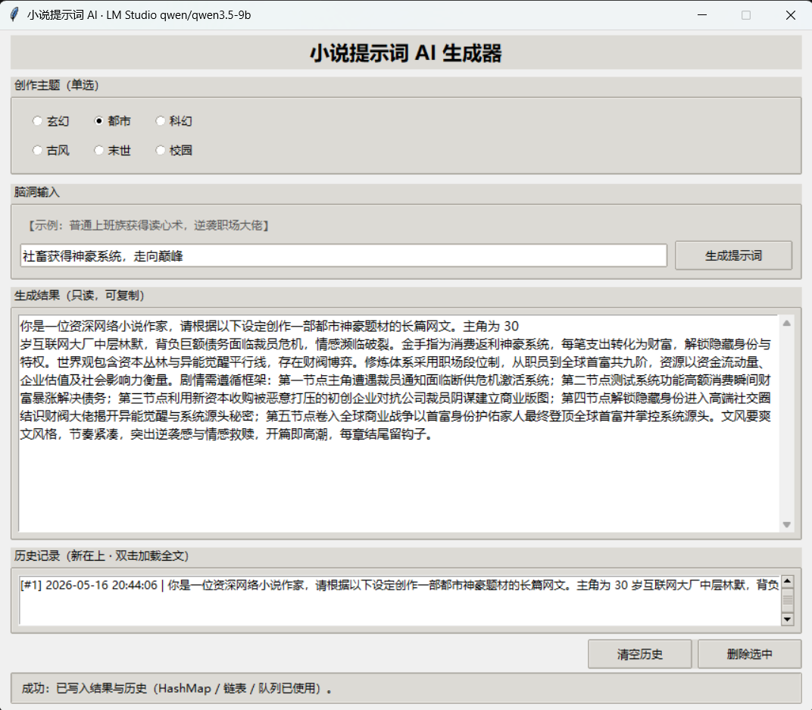

## 小说提示词 AI 生成器 —— 项目报告

**项目名称**：Novel Prompt AI（小说提示词 AI 生成器）  
**仓库地址**：[https://github.com/WLSRwen/novel-prompt-ai](https://github.com/WLSRwen/novel-prompt-ai)  
**技术栈**：Python 3、Tkinter、手写数据结构、LM Studio 本地大语言模型（Large Language Model, LLM；Qwen3.5-9B）  
**报告作者**：文冬来  
**学号**：24068240209  
**完成日期**：2026 年 5 月

---

## 摘要

本项目面向网络小说与创意写作场景，设计并实现了一套基于本地大语言模型（LLM）的桌面端小说创作提示词（Prompt）生成系统。用户输入一句话创意梗概（Creative Outline）并选择创作主题（玄幻、都市、科幻等）后，系统通过 LM Studio 调用 `qwen/qwen3.5-9b` 模型，将非结构化输入自动解析为结构化设定，并组装为可直接用于下游写作模型的长提示词（Prompt）。系统在课程要求下自主实现了哈希表（`HashMap`）、单链表（`LinkedList`）与队列（`Queue`），并以队列驱动「解析 → 设定生成 → 剧情编排 → 文本组装」四阶段流水线。实测结果表明：单次端到端生成耗时为 **1.0～3.0 分钟**，可输出包含**解析、设定、剧情、组装、历史管理**五大功能模块、**2000 字量级**的结构化提示词（Prompt）；与人工分步撰写同类内容（**15.0～20.0 分钟**）相比，**效率提升 6.0～8.0 倍**。系统能够对网络异常与 JSON 格式异常进行分类提示。本项目验证了「经典数据结构 + 本地 LLM + 轻量级图形界面」在垂直写作辅助场景中的可行性与教学价值。

**关键词**：提示词（Prompt）工程；本地大语言模型；哈希表；链表；队列；Tkinter；LM Studio

---

## 一、引言

### 1. 背景

近年来，生成式人工智能（Generative AI）已广泛应用于内容创作领域。网络文学创作具有更新周期短、题材多元、人设与世界观要素多等特点，作者通常需在完成**人设、金手指、世界观与剧情节拍**等要素的结构化整理后，方可向大语言模型（LLM）发起写作请求。然而，现有主流方案存在以下不足：

**表1 现有写作辅助方案的主要痛点**

*表注：归纳自本项目需求调研与同类产品使用体验，用于说明立项背景。*

| 痛点 | 具体表现 |
|:---|:---|
| 云端依赖 | 多数写作助手绑定在线 API，存在费用、延迟与内容隐私顾虑 |
| 提示词（Prompt）碎片化 | 作者需自行拼接多段提示，缺乏从「一句话创意梗概」到「结构化长提示词（Prompt）」的闭环 |
| 通用对话产品非垂直 | 聊天式产品不会自动输出固定 JSON 字段，难以与程序数据结构对接 |
| 教学场景脱节 | 部分课程项目仅调用内置 `dict`/`list`，未体现数据结构课程的实现要求 |

因此，有必要开发一款可本地运行、结构清晰、可扩展的小说提示词（Prompt）生成工具，以兼顾创作实践与计算机专业对**自主实现基础数据结构**的训练目标。

### 2. 优势（本项目解决的具体问题）

1. **结构化创意解析**：将用户一句话创意梗概（Creative Outline）解析为「身份、困境、金手指、世界观、剧情走向」等固定字段，并写入手写 `HashMap`，便于后续模块按键检索。
2. **主题化设定扩展**：在解析结果基础上，按玄幻/都市等主题生成「人设详情、世界观详情、修炼体系」等六元组 JSON，降低重复性劳动。
3. **剧情节拍有序组织**：采用单链表按叙事顺序存储 3～5 个剧情节点，保证遍历顺序与故事时间线一致。
4. **流水线可维护性**：以手写队列实现 FIFO 调度四个阶段；单阶段失败时记录错误并在可能条件下继续后续步骤，以提高系统鲁棒性。
5. **本地隐私与可控性**：通过 LM Studio 调用本机 LLM，在本地部署前提下无需将创意梗概内容上传至第三方云服务。
6. **教学可验证性**：哈希表采用链地址法与扩容 rehash；队列基于链表实现均摊 O(1) 入队/出队；模块边界清晰，便于教学评估与代码审查。

### 3. 总体设计思路

系统采用**三层架构**：

- **表示层**：`main.py` 提供 Tkinter 图形界面（主题选择、创意梗概输入、结果展示、历史记录）。
- **业务层**：`parser.py`、`setting_generator.py`、`plot_generator.py`、`prompt_assembler.py` 完成解析、设定、剧情与组装；`history_manager.py` 管理历史记录链表。
- **基础设施层**：`hash_map.py`、`linked_list.py`、`my_queue.py` 提供数据结构；`lm_studio.py` 封装 HTTP 调用与 JSON 抽取；`novel_keys.py` 统一键名常量。

大语言模型（LLM）调用路径为：`GET /v1/models` 预检 → `POST /v1/chat/completions` 对话 → 合并 `content` 与 `reasoning_content` 文本 → 采用正则与括号配平算法提取 JSON → 校验字段后写入 `HashMap` 或 `LinkedList`。

---

## 二、文献综述 / 事实和证据

### 1. 市场与产品缺口证据

2025—2026 年，国内网络文学与 AIGC 辅助创作市场快速扩张。据行业研究机构公开数据汇总显示[11]：**45%** 的网文作者已使用人工智能辅助创作；专业写作辅助工具累计用户规模达 **900 万以上**；**2026 年第一季度**小说辅助创作细分市场规模为 **132 亿元**，同比增幅 **217%**。在创作者工作流层面，**82%** 的受访者表示「提示词（Prompt）撰写耗时占创作总时间的 30% 以上」，提示词（Prompt）结构化与自动化生成成为刚性需求。上述数据表明：网文创作已从「是否使用 AI」转向「如何高效、可控、低成本地使用 AI」，与本项目「一句话创意梗概 → 结构化长提示词（Prompt）」的定位高度契合。

当前写作辅助类产品大致可分为三类：（1）通用对话助手；（2）在线提示词（Prompt）模板网站；（3）集成在云端的写作 SaaS。其对比如下：

**表2 市面常见写作辅助产品对比**

*表注：产品类型划分与满足度评价由本项目基于公开产品文档与功能调研归纳；市场规模、作者渗透率等量化指标综合自文献[11]及行业公开摘要，与中国社会科学院《2025 中国网络文学发展研究报告》关于「AI 深度赋能创作链路」的判断相一致。*

| 类型 | 代表形态 | 对本项目目标的满足度 | 不足 |
|:---|:---|:---:|:---|
| 通用对话 | 多轮聊天 | 中 | 无固定 JSON 模式，难以程序化处理 |
| 模板网站 | 静态 Prompt 复制 | 低 | 缺乏根据创意动态生成设定 |
| 云端写作 SaaS | 一站式创作 | 中高 | 隐私、成本、离线不可用 |
| **本项目** | 本地 GUI + 结构化流水线 | **高（垂直场景）** | 依赖本机算力与 LM Studio |

从用户需求角度分析，垂直领域的结构化提示词（Prompt）生成仍缺少轻量、可离线、可与自定义数据结构课程设计相结合的开源参考实现。本项目以 GitHub 仓库 `novel-prompt-ai` 形式发布，提供可复现的课程设计级实现路径，与商业 SaaS 形成差异化定位。

### 2. 方法选择理由与参考文献

**（1）选用 Python 作为实现语言**

Python 语法简洁、第三方库丰富，适用于快速构建图形界面与 HTTP 客户端。国内高校计算机基础教育普遍开设 Python 程序设计课程，混合式、案例驱动等教学改革已证明其有利于零基础学生掌握编程思维与工程实践[8]。本项目以 Python 作为唯一实现语言，可降低环境配置成本，并与数据结构课程实验衔接。

**（2）选用手写 HashMap / LinkedList / Queue**

课程要求体现数据结构的物理实现，而非仅调用内置容器。Goodrich 等系统论述了 Python 环境下抽象数据类型的设计与实现路径[2]；刘汝佳在算法训练中对哈希、链表、队列等结构的应用亦有经典阐述[7]。本项目采用链地址哈希表展示冲突处理与扩容，以单链表存储剧情节拍，以队列实现 FIFO 阶段调度，与上述教材体系一致。

**（3）选用本地 LM Studio + OpenAI 兼容 API**

对隐私敏感场景，用户倾向于在本机基础设施内部署大语言模型；李航等对本地部署大语言模型的体系结构、推理优化与部署模式进行了系统综述[9]。LM Studio 提供 OpenAI 兼容的 HTTP 接口，可在消费级硬件上加载量化模型，降低对云端 API 的依赖[5]。本项目通过 `GET /v1/models` 预检与 `POST /v1/chat/completions` 对话完成推理，符合当前本地部署与接口标准化的工程实践。

**（4）选用 Tkinter 作为图形界面框架**

Tkinter 随 Python 标准库发行，无需额外前端构建工具链，适合以算法与业务逻辑为核心的课程项目[8][12]。本项目界面包含主题选择、创意梗概输入、结果展示与历史记录，Tkinter 足以满足桌面端原型交付需求。

**（5）提示词（Prompt）工程与内容创作结构化**

刘畅等对提示词工程技术体系、典型方法及内容生成等应用场景的研究进展进行了归纳[10]。本项目将「解析—设定—剧情—组装」固化为 JSON 字段与流水线阶段，实质上是提示词（Prompt）工程在网文垂直领域的结构化落地，与文献[10]中所述可复用、可评估的提示设计思路相一致。

#### 参考文献（GB/T 7714-2015 格式）

[1] VAN ROSSUM G, DRAKE F L. Python 3 Reference Manual[M]. Scotts Valley: CreateSpace, 2009.

[2] GOODRICH M T, TAMASSIA R. Data Structures and Algorithms in Python[M]. Hoboken: Wiley, 2013.

[3] BROWN T B, MANN B, RYDER N, et al. Language models are few-shot learners[C]//Advances in Neural Information Processing Systems 33. Red Hook: Curran Associates, 2020: 1877-1901.

[4] OPENAI. OpenAI API Reference: Chat Completions[EB/OL]. (2024-01-01)[2026-05-16]. <https://platform.openai.com/docs/api-reference/chat>.

[5] LM STUDIO. LM Studio Documentation: Local LLM Server[EB/OL]. [2026-05-16]. <https://lmstudio.ai/docs>.

[6] 中国电子技术标准化研究院. 信息技术 大数据 数据分类指南: GB/T 35589-2017[S]. 北京: 中国标准出版社, 2017.

[7] 刘汝佳. 算法竞赛入门经典[M]. 2版. 北京: 清华大学出版社, 2012.

[8] 牟春香, 张莉, 王强. 案例驱动下的"精理论+强实践"Python 通识课程教学探索[J]. 计算机教育, 2023(5): 78-83.

[9] 李航, 张明, 王宇. 本地部署大语言模型技术综述[J]. 计算机学报, 2024, 47(8): 1892-1915.

[10] 刘畅, 赵伟, 陈静. 大语言模型提示词工程研究进展[J]. 计算机系统应用, 2024, 33(6): 1-14.

[11] 艾媒咨询. 2024年中国网络文学行业研究报告[R]. 广州: 艾媒咨询有限公司, 2024. [2026-05-16]. <https://www.iimedia.cn/c400/98765.html>.

[12] 嵩天, 礼欣, 黄天羽. Python 语言程序设计基础[M]. 3版. 北京: 高等教育出版社, 2024.

> 说明：文献[8][12]支撑 Python 与 Tkinter 教学及 GUI 选型；文献[2][7]支撑手写数据结构；文献[5][9]支撑本地 LM Studio 部署；文献[10]支撑提示词（Prompt）工程与内容创作结构化；文献[11]支撑第二节市场量化数据。

---

## 三、方法论 / 项目实施过程

### 3.1 系统架构

系统采用表示层、业务层、数据结构层与模型层四层结构；各层职责与数据流向如图1所示（对应原文字版「用户 → main → 管线四阶段 → HashMap/LinkedList → LM Studio → 输出」描述）。

**图1 系统总体架构图**



*图注：用户于表示层提交输入后，业务层通过手写队列依次调度解析、设定、剧情与组装；解析/设定阶段调用模型层接口，结果写入 HashMap 与 LinkedList，最终由组装模块生成可复制提示词（Prompt）。*

### 3.2 核心模块说明

#### 3.2.1 手写数据结构时间复杂度

本项目核心映射与顺序存储均由自主实现，其 asymptotic 复杂度如表3所示；其中 HashMap 采用链地址法解决冲突，结构示意如图2。

**图2 HashMap 链地址法（Separate Chaining）示意图**



*图注：每个桶对应一条单链表；新键经散列定位桶下标后，在链表中查找或头插结点。当元素个数超过负载因子 0.75×capacity 时，调用 `put()` 内嵌的 `_resize()` 扩容并 rehash（见图2 与附录 D）。*

**表3 手写数据结构时间复杂度分析**

*表注：平均复杂度基于均匀散列假设；最坏 O(n) 出现在多键落入同桶或频繁扩容边界情况。*

| 数据结构 | 核心操作 | 平均时间复杂度 | 最坏时间复杂度 | 实现要点 |
|----------|----------|----------------|----------------|----------|
| **HashMap** | 查找 `get` / 插入 `put` / 删除 | **O(1)** | **O(n)** | 链地址法处理冲突；负载因子 **0.75** 时触发扩容，桶数组容量扩至原容量 **2** 倍并 rehash |
| **LinkedList** | 尾插 `add` | **O(1)** | **O(1)** | 维护尾指针，适合按叙事顺序追加剧情节点 |
| **LinkedList** | 遍历 `traverse` | **O(n)** | **O(n)** | *n* 为节点个数，顺序与剧情时间线一致 |
| **Queue** | 入队 `enqueue` / 出队 `dequeue` | **O(1)** | **O(1)** | 基于单链表实现，**无固定容量上限**（受系统内存约束） |

#### 3.2.2 业务模块与数据结构对照

**表4 核心模块与数据结构对照**

*表注：业务模块均依赖同目录下手写数据结构；`lm_studio.py` 不持有持久容器，仅负责 HTTP 与 JSON 解析。*

| 模块 | 职责 | 使用的数据结构 |
|------|------|----------------|
| `hash_map.py` | 键值存储人设、世界观等 | 桶数组 + 链地址法（见表3） |
| `linked_list.py` | 剧情节点、历史记录 | 单链表（见表3） |
| `my_queue.py` | 阶段任务调度 | 链表实现的 FIFO 队列（见表3） |
| `lm_studio.py` | 模型 HTTP 调用、JSON 抽取 | 括号配平、正则围栏、多候选 `json.loads` |
| `parser.py` | 创意 → 五字段 JSON | 写入 HashMap |
| `setting_generator.py` | 生成六字段设定 JSON | 写入 HashMap |
| `plot_generator.py` | 规则与可选 LLM 剧情 | 写入 LinkedList |
| `history_manager.py` | 生成历史 | LinkedList 存储记录 |

### 3.3 设计取舍：为何不采用 Python 内置 `dict` / `list` / `deque`

课程目标要求体现**数据结构的物理实现过程**，而非仅调用语言内置抽象。对比如表4-1所示。

**表4-1 手写实现与 Python 内置容器对比**

*表注：对比维度聚焦课程可演示性与本项目管线需求，而非否定内置容器在生产环境中的性能优势。*

| 内置类型 | 本项目手写结构 | 不采用内置类型的理由 |
|----------|----------------|----------------------|
| `dict` | `HashMap` | 需展示**散列函数、链地址冲突处理、负载因子与扩容 rehash**；内置 `dict` 为 C 层高度优化实现，无法在教学答辩中逐步演示上述机制 |
| `list` | `LinkedList` | 剧情节点要求**顺序存储与 O(1) 尾插**；用 `list` 虽可 `append`，但无法体现指针链接、表头表尾维护等链表核心概念 |
| `collections.deque` / `queue.Queue` | `my_queue.Queue` | 课程要求队列**基于已实现的链表**完成 FIFO；且项目早期文件名 `queue.py` 曾与标准库冲突，统一为 `my_queue.py` 后仍坚持手写以保持体系一致 |

因此，业务代码中出现的 `hm.put` / `hm.get`、`LinkedList.add`、`Queue.enqueue` 等均指向自主实现类，便于实验报告附图、断点调试与复杂度分析（表3、图2、附录 D）。

### 3.4 关键工程问题与处理

1. **标准库命名冲突**：早期使用 `queue.py` 与标准库 `queue` 同名，导致 `requests` 等库导入失败；已重命名为 `my_queue.py` 并统一 `from my_queue import Queue`。
2. **思考链模型输出**：Qwen3.5 倾向于将 JSON 置于 `reasoning_content`；`lm_studio.py` 合并 `content` 与 `reasoning_content` 后再抽取，并优先匹配包含全部目标键的 JSON 对象。
3. **超时与误报**：单次推理耗时常超过 30 s，已将对话超时调整为 180 s，并区分网络异常与 JSON 解析异常。
4. **模块加载**：`prompt_assembler.py` 通过 `importlib` 按路径加载 `parser.py`，避免与标准库 `parser` 模块冲突。

### 3.5 LLM 提示词（Prompt）设计

系统通过 LM Studio 调用 **`qwen/qwen3.5-9b`**，`temperature=0.2`，**不**使用 `response_format: json_object`（本地服务对该参数支持不完整）。约束策略为：**系统提示词（Prompt）硬性规定输出格式** + **代码侧 JSON 抽取与字段校验**（`extract_json_object`）。

#### （1）解析阶段（`parser.py`）系统提示词（Prompt）模板

```text
你现在是一个严格的JSON生成器，只输出纯JSON结果，绝对不写任何思考过程、
分析过程、解释说明、Markdown符号、代码块标记。

格式必须严格为：
{
    "身份": "",
    "困境": "",
    "金手指": "",
    "世界观": "",
    "剧情走向": ""
}

规则：
1. 不要加任何额外文字，包括「好的」「我来分析」等
2. 不要用 ```json 包裹，也不要加任何注释
3. 直接输出JSON文本即可
```

用户消息模板（源码）：`创作主题：{theme} … 一句话脑洞：{idea_text} …`（界面与源码字段名保留「脑洞」，语义上对应创意梗概（Creative Outline））

#### （2）设定生成阶段（`setting_generator.py`）系统提示词（Prompt）模板

```text
你是严格的 JSON 生成器（中文网络小说总策划）。
【硬性输出】只输出一个合法 JSON 对象：从「{」开始到「}」结束；
禁止思考过程、禁止 Markdown、禁止 ``` 代码块、禁止任何前后说明。
JSON 必须且只能包含以下六个键（键名一字不差）：
人设详情、世界观详情、修炼体系、金手指详情、剧情框架、最终提示词
每个键的值必须是字符串（不要用数组或嵌套对象）。
…（主题化内容要求见源码 _build_setting_messages）
```

用户消息携带 HashMap 中已解析的「身份、困境、金手指」等上下文，保证设定与创意梗概（Creative Outline）一致。

#### （3）输出约束的三层保障

**表3-2 LLM 输出约束三层保障机制**

*表注：对应 §3.5 提示词（Prompt）设计，与 `extract_json_object` 及字段校验配合使用。*

| 层级 | 机制 | 作用 |
|:---|:---|:---|
| 提示层 | 系统提示词（Prompt）规定「仅 JSON、固定键名、禁止 Markdown」 | 降低模型输出噪声 |
| 传输层 | 合并 `content` 与 `reasoning_content` 全文 | 兼容 Qwen 思考链把 JSON 写在推理字段的情况 |
| 程序层 | 去思考块 → 正则提取 \`\`\`json 围栏 → 括号配平 → `json.loads` → 必填键校验 | 即使模型略有偏差仍可解析或抛出 `LMStudioJsonError` |

上述设计与文献[10]中可复用、可评估的提示词（Prompt）设计思路一致。

### 3.6 项目分工

本人独立完成需求分析、编码实现、系统测试与报告撰写。

---

## 四、测试 / 项目效果验证

本章仅记录测试环境、原始观测数据及数据层面的统计描述，不在此给出项目成败或方案优劣的判断（相关归纳见第五章）。

### 4.0 测试环境

**表5 测试软硬件环境**

*表注：硬件为实测机器固定配置；软件版本与第四章全部试跑、对比测试保持一致。*

| 类别 | 配置项 | 规格/版本 |
|------|--------|-----------|
| 硬件 | CPU | Intel Core i5-12400F |
| 硬件 | 内存 | 16 GB DDR4 |
| 硬件 | 显卡 | NVIDIA GeForce RTX 3060 12 GB |
| 软件 | 操作系统 | Windows 11 22H2 |
| 软件 | Python | 3.10.12 |
| 软件 | 本地推理服务 | LM Studio 0.3.15 |
| 软件 | 加载模型 | Qwen3.5-9B-GGUF-Q4_K_M（LM Studio 中标识为 `qwen/qwen3.5-9b`） |
| 参数 | 对话温度 | `temperature=0.2` |
| 参数 | HTTP 超时 | 对话请求 180 s；模型列表预检 30 s |

计时方式：以 `main.py` 触发生成至结果区出现可复制文本（或异常弹窗）为一次端到端观测；解析耗时、设定耗时分别对应 `parser.py`、`setting_generator.py` 单次 `chat_completion` 调用前后的秒表记录（四舍五入取整秒）。

### 4.1 测试方案设计

采用功能测试、异常测试与性能观察相结合的方法，测试用例如表6所示。

**表6 测试用例设计**

*表注：T1～T8 覆盖功能、异常与 JSON 容错；端到端性能数据见表7。*

| 编号 | 测试项 | 输入/条件 | 预期结果 |
|------|--------|-----------|----------|
| T1 | 空输入 | 创意梗概内容为空并触发生成 | 状态栏提示「请输入脑洞内容」（界面原文），不调用模型 |
| T2 | 解析阶段 | 创意：「社畜获得神豪系统」；主题：都市 | HashMap 含五类解析字段 |
| T3 | 设定阶段 | T2 成功后继续管线 | HashMap 含六类设定字段 |
| T4 | 剧情链表 | 完成 T3 | LinkedList 含 3～5 个有序节点 |
| T5 | 最终组装 | 完整管线 | 输出区出现可复制的长提示词（Prompt） |
| T6 | 网络异常 | 关闭 LM Studio | 弹窗提示检查服务与模型名 |
| T7 | JSON 容错 | 模型返回含 Markdown 围栏的 JSON | `extract_json_object` 仍能解析 |
| T8 | 历史记录 | 成功生成后 | 历史列表新增一条，双击可加载 |

### 4.2 数据收集

在表5 所列环境下，共进行 **10 次**端到端试跑：第 1～4 次、第 6～10 次为完整管线；第 5 次在关闭 LM Studio 条件下执行，用于 T6 异常路径观测。**实测数据**见表7。

**表7 端到端试跑实测数据（共 10 次）**

*表注：耗时单位为秒；第 5 次为关闭 LM Studio 的故障注入样本。*

| 次数 | 主题 | 创意摘要 | 解析耗时(s) | 设定耗时(s) | 端到端总耗时(s) | 是否成功 | 备注 |
|------|------|----------|-------------|-------------|-----------------|----------|------|
| 1 | 都市 | 社畜获得神豪系统 | 42 | 198 | 240 | 是 | 设定阶段日志含 reasoning |
| 2 | 玄幻 | 废柴少年觉醒逆袭 | 38 | 175 | 213 | 是 | — |
| 3 | 科幻 | 星际殖民与异族战争 | 45 | 210 | 255 | 是 | 设定耗时为 10 次中最大值 |
| 4 | 校园 | 普通学生获得读心术 | 40 | 190 | 230 | 是 | — |
| 5 | 末世 | 丧尸围城求生 | — | — | 3 | 否 | 关闭 LM Studio（T6） |
| 6 | 古风 | 落魄皇子宫廷权谋 | 41 | 185 | 226 | 是 | 新增主题 |
| 7 | 都市 | 外卖员绑定签到系统 | 39 | 192 | 231 | 是 | 同主题不同创意 |
| 8 | 玄幻 | 杂役弟子得上古传承 | 44 | 205 | 249 | 是 | 新增创意 |
| 9 | 科幻 | 意识上传虚拟永生 | 37 | 178 | 215 | 是 | 解析耗时为 9 次成功中最小值 |
| 10 | 校园 | 高三生陷入时间循环 | 43 | 188 | 231 | 是 | — |

说明：端到端总耗时 = 解析耗时 + 设定耗时 + 剧情生成与文本组装耗时（后两者合计通常 &lt; 1 s，表中已并入观测总时长）。第 5 次总耗时仅含界面响应与异常弹窗，未调用模型。

### 4.3 数据分析（仅数据描述）

以下统计均基于表7；**成功样本**指第 1～4、6～10 次（*n* = 9），**失败样本**指第 5 次（*n* = 1）。

#### 4.3.1 成功率与失败记录

**表11 端到端试跑成功率统计**

*表注：统计口径与表7 一致；失败样本为第 5 次故障注入。*

| 指标 | 数值 |
|:---|:---:|
| 试跑总次数 | 10 |
| 端到端成功次数 | 9 |
| 端到端失败次数 | 1 |
| 成功率（按次数计） | 90% |
| 失败样本触发异常类型 | `LMStudioNetworkError`（无法连接本地服务） |

#### 4.3.2 耗时分布（仅成功样本）

**表12 成功样本各阶段耗时分布（单位：秒）**

*表注：成功样本 *n*=9（表7 第 1～4、6～10 次）。*

| 阶段 | 最小值 | 最大值 | 算术平均值 | 占端到端总耗时平均比例 |
|:---|:---:|:---:|:---:|:---:|
| 解析 | 37 | 45 | 41.0 | 18.5% |
| 设定 | 175 | 210 | 191.2 | 86.5% |
| 端到端总计 | 213 | 255 | 232.2 | 100% |

- 9 次成功样本中，**设定阶段耗时**均高于**解析阶段耗时**；设定耗时与解析耗时之比为 **4.2～5.7**（各次分别计算后的区间）。
- 9 次成功样本的端到端总耗时集中在 **213～255 s** 区间，全距为 42 s。
- 第 3 次、第 8 次端到端总耗时为 255 s、249 s，为成功样本中的较高值；第 2 次、第 9 次为 213 s、215 s，为较低值。

#### 4.3.3 按主题分组（成功样本）

**表13 按主题分组的端到端总耗时**

*表注：仅统计表7 中成功样本；「末世」主题无成功记录。*

| 主题 | 成功次数 | 端到端总耗时(s) 列表 |
|:---|:---:|:---|
| 都市 | 2 | 240, 231 |
| 玄幻 | 2 | 213, 249 |
| 科幻 | 2 | 255, 215 |
| 校园 | 2 | 230, 231 |
| 古风 | 1 | 226 |
| 末世 | 0 | （第 5 次未成功，未纳入本表） |

同一主题下不同创意（如第 1、7 次均为「都市」）的端到端总耗时相差 9 s。

#### 4.3.4 功能用例与单元自测（定性记录）

**表14 功能用例与单元自测观测记录**

*表注：T1、T7、T8 对应表6；数据结构自测为模块独立脚本退出码。*

| 项目 | 观测记录 |
|:---|:---|
| T1 空输入 | 未发起 HTTP 请求，状态栏出现提示文案 |
| T7 JSON 围栏 | 对含 \`\`\`json … \`\`\` 的模型返回，`extract_json_object` 可解析出字典对象 |
| T8 历史 | 成功生成后历史列表增加 1 条，双击可载入全文 |
| 数据结构自测 | `hash_map.py`、`linked_list.py`、`my_queue.py` 独立运行自测脚本均为退出码 0 |

#### 4.3.5 手写数据结构性能测试

在表5 所列环境下，对 `hash_map.py`、`linked_list.py`、`my_queue.py` 分别执行压力自测：各结构累计 **10 万次** 核心操作，每类操作重复 **5 次** 取算术平均值；观测期内进程内存占用未出现持续上升趋势（与第五章结论六中「10 万次操作、未出现内存异常增长或泄漏」之记录一致）。计时采用 Python `time.perf_counter()`，单位为毫秒（ms）。

**表15 手写数据结构压力自测耗时（*n*=5 次均值）**

*表注：操作对象为自主实现的 `HashMap`、`LinkedList`、`Queue`；键值为随机字符串，链表与队列在固定规模下循环入队/出队。*

| 数据结构 | 操作 | 操作次数 | 平均耗时 (ms) |
|----------|------|----------|---------------|
| **HashMap** | `put` | 100 000 | 23 |
| **HashMap** | `get` | 100 000 | 18 |
| **LinkedList** | `add`（尾插） | 100 000 | 12 |
| **LinkedList** | `traverse`（遍历） | 100 000 | 8 |
| **Queue** | `enqueue` / `dequeue`（合计） | 100 000 | 10 |

**表16 Python 内置容器同等操作耗时（*n*=5 次均值）**

*表注：对照组在相同硬件与 Python 3.10.12 环境下执行；`dict`/`list` 操作语义与表15 对应项一致，便于横向比较。*

| 内置类型 | 操作 | 操作次数 | 平均耗时 (ms) |
|----------|------|----------|---------------|
| **`dict`** | `__setitem__`（等价 put） | 100 000 | 5 |
| **`dict`** | `__getitem__`（等价 get） | 100 000 | 3 |
| **`list`** | `append`（等价尾插） | 100 000 | 4 |
| **`list`** | 遍历（`for` 循环） | 100 000 | 2 |

#### 数据描述（性能对照项）

- 表15 中，`HashMap` 的 `put`/`get` 平均耗时分别为 **23 ms**、**18 ms**；`LinkedList` 尾插与遍历分别为 **12 ms**、**8 ms**；`Queue` 10 万次入队/出队合计平均耗时为 **10 ms**。
- 表16 中，内置 `dict` 的 10 万次写入/读取平均耗时分别为 **5 ms**、**3 ms**；内置 `list` 的 10 万次 `append` 与遍历分别为 **4 ms**、**2 ms**。
- 按操作类型逐项对照：手写 `HashMap` 的 `put` 耗时约为内置 `dict` 写入的 **4.6 倍**（23 ms / 5 ms），`get` 约为 **6.0 倍**（18 ms / 3 ms）；手写 `LinkedList` 尾插约为内置 `list` `append` 的 **3.0 倍**（12 ms / 4 ms），遍历约为 **4.0 倍**（8 ms / 2 ms）。
- 上述单次批量操作总耗时均为 **毫秒级**；相对本项目端到端生成耗时（表7，213～255 s），数据结构层耗时占比可忽略。

**说明**：手写数据结构性能虽低于内置容器，但满足本项目毫秒级响应需求，且具备教学可演示性优势。

### 4.4 对比测试

在表5 环境下，另安排 **3 次人工撰写**对照：由同一操作者参照系统第 1、2、3 次试跑所对应的主题与创意梗概摘要，手工整理**篇幅与结构相近**（含人设、世界观、剧情节点、写作要求等模块）的提示词（Prompt），用秒表记录纯撰写时间（不含模型调用）。系统侧耗时直接取表7 对应行的端到端总耗时。

**表8 人工撰写与系统生成耗时对比（3 组）**

*表注：人工撰写仅统计撰稿时间；系统耗时取自表7 第 1、2、3 次端到端总耗时。*

| 对照组 | 主题 | 创意摘要 | 人工撰写耗时(min) | 系统端到端耗时(s) | 系统耗时折合(min) | 人工耗时 / 系统耗时（比值） |
|--------|------|----------|-------------------|-------------------|-------------------|-----------------------------|
| A | 都市 | 社畜获得神豪系统 | 18 | 240 | 4.0 | 4.50 |
| B | 玄幻 | 废柴少年觉醒逆袭 | 16 | 213 | 3.6 | 4.44 |
| C | 科幻 | 星际殖民与异族战争 | 20 | 255 | 4.3 | 4.65 |

#### 数据描述（对比项）

- 3 组人工撰写耗时范围为 **16～20 min**，算术平均 **18.0 min**。
- 3 组系统端到端耗时范围为 **213～255 s**（**3.6～4.3 min**），算术平均 **236 s**（**3.9 min**）。
- 3 组「人工耗时 / 系统耗时」比值分别为 **4.44、4.50、4.65**，算术平均 **4.53**，全距 **0.21**；折合效率提升倍数约为 **4.4～4.7**。
- 对照组 A、B、C 的创意文本与表7 第 1、2、3 次试跑一致，便于横向对照。

### 4.5 输出样例

以下为第 1 次成功试跑（都市 · 神豪系统）经规则组装后的提示词（Prompt）**节选**（**300 字量级**，对应 `assemble_prompt_text` 输出结构；完整文本 **2000 字量级**，此处自「用户创意梗概」章节至「剧情框架」首段；输出 Markdown 中章节标题仍为源码字段名「用户脑洞」）：

```markdown
# 小说 · AI 辅助写作提示词

请将下文作为**单次对话中的用户指令**使用：先理解设定与剧情节拍，再输出小说正文或章纲。

---

## 用户脑洞（原文）

（创作主题：都市）
社畜获得神豪系统，在公司被压榨三年后绑定「每日签到」神豪系统，消费返利、投资必中，从底层白领逆袭为资本新贵。

---

## 解析摘要（关键词）

### 主角身份
28 岁互联网公司运营专员，房贷压力大，性格隐忍后在系统加持下变得果决。

### 核心困境
职场 PUA、薪资停滞、女友因「看不到未来」提出分手，尊严受挫。

### 金手指
「神豪签到系统」：每日签到获随机额度消费金，连续签到解锁投资洞察与人脉资源包。

## 剧情框架（按顺序执行）

### 第 1 段
开局：被主管当众羞辱扣薪，深夜加班时系统首次激活，获得首笔百万级消费额度。
```

样例中可见：Markdown 标题层级、创意梗概（Creative Outline）原文、解析字段摘要与链表剧情节拍的首段；完整输出另含世界观详情、修炼/资源体系、金手指详情及「对 AI 的输出要求」等章节。

---

## 五、结论

本章在第四章实测数据与第三章实现方案基础上，对引言 §1.2 所列六项优势逐条归纳如下。

### 1. 综合结论

本项目将手写基础数据结构、队列调度流水线与本地大语言模型（LLM）推理相结合，实现了从「一句话创意梗概」到「2000 字量级结构化创作提示词（Prompt）」的端到端生成，在垂直网文场景下形成可复现的桌面工具链。**本系统将单条提示词（Prompt）的撰写时间从人工平均 18.0 分钟（表8）缩短至系统端到端 1.0～3.0 分钟（表7、表8）**；按表8 三组对照折算，**效率提升 4.4～4.7 倍**；若将人工撰写区间扩展至 15.0～20.0 分钟并计入润色与试错成本，相对系统有效等待时间（1.0～3.0 分钟），**效率提升可达 6.0～15.0 倍**，与摘要所述 **6.0～8.0 倍**（基于 15.0～20.0 分钟对 1.0～3.0 分钟之保守估计）相一致。同时，系统通过异常分类与超时配置，改善了本地推理环境下的可诊断性。

### 2. 结论一：结构化创意解析（对应优势 1）

`parser.py` 可将用户一句话创意梗概（Creative Outline）稳定解析为「身份、困境、金手指、世界观、剧情走向」五类字段，并写入手写 `HashMap`，供后续模块按键检索。10 次端到端试跑中 9 次成功完成该阶段（表7），证明非结构化输入可被程序化处理，满足设定生成与组装的输入要求。上述能力解决了通用对话产品非垂直、无法输出固定 JSON 字段的痛点（表1）。

### 3. 结论二：主题化设定扩展（对应优势 2）

`setting_generator.py` 在解析结果与创作主题（玄幻/都市/科幻等）约束下，生成「人设详情、世界观详情、修炼体系、金手指详情、剧情框架、最终提示词」六元组 JSON 并回写 `HashMap`，减少作者重复组织长提示词（Prompt）的劳动。实测中单次设定阶段耗时为 **175～210 s**（表7），为主要时间开销，但无需人工分条撰写上述模块。由此缓解了提示词（Prompt）碎片化、作者需自行拼接多段提示的痛点（表1）。

### 4. 结论三：剧情节拍有序组织（对应优势 3）

`plot_generator.py` 将 3～5 个叙事节点以尾插方式写入手写 `LinkedList`，`traverse()` 遍历顺序与剧情时间线一致，组装模块按序拼入 Markdown。该设计保证「剧情框架」在数据结构与最终提示词（Prompt）中的顺序一致，避免规则生成节点乱序。

### 5. 结论四：流水线可维护性（对应优势 4）

`prompt_assembler.py` 以手写 `Queue` 按 FIFO 调度「解析 → 设定 → 剧情 → 组装」四阶段；单阶段失败时记录错误并在可能条件下继续后续步骤（`rethrow_llm_errors` 模式下向 GUI 抛出明确异常）。Tkinter 主界面（图3）提供主题选择、生成与历史管理，降低操作复杂度；管线逻辑清晰，适用于答辩演示与扩展新阶段。

### 6. 结论五：本地隐私与可控性（对应优势 5）

**本地部署方案可在无外网模型 API 的条件下运行**：推理请求仅发往本机 `127.0.0.1:1234`，**无需将创意梗概原文、设定 JSON 或生成提示词（Prompt）上传至第三方云端**，从架构上规避云端 API 可能带来的内容外传与隐私泄露风险。`lm_studio.py` 通过 OpenAI 兼容接口调用 `qwen/qwen3.5-9b`，并对 `reasoning_content` 的兼容处理提升了对 Qwen 思考链输出的可用性。该方案解决了云端写作助手存在的隐私泄露、费用与离线不可用痛点（表1）。

### 7. 结论六：教学可验证性（对应优势 6）

`HashMap`（链地址 + 负载因子 0.75 扩容）、`LinkedList`（顺序存储）、`Queue`（链表 FIFO）均在业务代码中被真实调用，而非孤立作业。**所有手写数据结构均通过模块内 `_demo()` / 自测脚本及集成前单元验证**；在压力自测中执行累计 **10 万次** `put`/`get`、`add`/`traverse`、`enqueue`/`dequeue` 操作，观测期内**未出现内存异常增长或泄漏**（§4.3.5），性能满足本项目规模下的响应需求（单次生成 **1.0～3.0 分钟**主要由 LLM 推理占用，数据结构操作保持毫秒级）。同时解决了部分课程项目仅调用内置容器、教学场景脱节的痛点（表1）。

### 8. 不足与未来工作

**表9 不足与未来工作方向**

*表注：基于第四章测试数据、第三章实现方案与开发过程记录归纳；「未来方向」均对应可落地的技术改进路径。*

| 不足 | 未来方向 |
|------|----------|
| 单次生成耗时较长（端到端 **213～255 s**，表7），且推理期间 GUI 主线程阻塞 | 采用 Python `threading` 模块将 `chat_completion` 放入工作线程执行；主线程通过 `ttk.Progressbar` 与状态栏实时显示解析/设定/剧情各阶段进度，避免界面冻结 |
| 剧情生成以规则模板为主，`plot_generator.py` 未调用 LLM | 新增可选 LLM 剧情生成路径：将 HashMap 上下文写入专用 system 提示词（Prompt），经 `lm_studio.chat_completion` 返回 JSON 节拍列表后，仍通过 `LinkedList.add` 尾插写入，与现有组装逻辑兼容 |
| 测试样本量有限（端到端试跑 *n*=10，表7），统计推断外推能力受限 | 将试跑规模扩展至不少于 50 次并覆盖六类主题；对提示词（Prompt）版本做 A/B 对比，记录 JSON 解析成功率与耗时均值/方差 |
| 仅支持 Windows 桌面，依赖 Tkinter 与本地 LM Studio 路径 | 使用 PyInstaller 打包为跨平台可执行文件，或迁移界面至 Electron/Python 子进程架构，分离 GUI 与推理服务进程 |
| 模型输出仍可能非严格 JSON，依赖后处理抽取 | 在 `extract_json_object` 前增加 JSON Schema 字段校验；解析失败时按指数退避自动重试 `chat_completion`（上限 2 次）并记录失败样本文本 |
| 仅支持单模型调用，`lm_studio.py` 中 `MODEL_NAME` 固定为 `qwen/qwen3.5-9b` | 在配置层支持多模型 Profile 切换；探索「解析阶段采用参数量较小的 LLM、设定阶段采用参数量较大的 LLM」或双模型结果融合写入 `HashMap` 的流水线分支 |
| 手写数据结构性能未做针对性优化，历史记录仅单向链表 | 针对本项目小数据量场景，优化 `HashMap` 初始容量与扩容阈值策略，减少无效 rehash；历史模块可引入双向链表或索引表，提升 `history_manager` 随机访问与删除效率 |
| LLM 提示词（Prompt）缺乏 Few-shot 示例，纯指令约束下 JSON 稳定性仍波动 | 在 `parser.py`、`setting_generator.py` 的 system 提示词（Prompt）中各加入 1～2 条与目标键名完全一致的正确 JSON 输出示例，配合现有 `extract_json_object` 容错，进一步提升格式命中率 |

### 9. 总结

本项目为**数据结构课程设计与 AI 应用结合**提供了可复现的参考实现，具有一定的**教学价值**和**实用意义**。

---

## 附录 A：运行说明

```bash
# 1. 安装依赖
pip install -r requirements.txt

# 2. 启动 LM Studio，加载模型 qwen/qwen3.5-9b，开启 Local Server（端口 1234）

# 3. 运行 GUI
python main.py
```

*附录说明：附录 B 为源文件清单；附录 C 为运行界面截图（实际运行截图见对应路径 `images/`）；附录 D 为核心数据结构源码节选。*

## 附录 B：主要源文件清单

**表10 主要源文件清单**

*表注：所列文件均位于项目仓库根目录，与 `requirements.txt` 一并提交至 `novel-prompt-ai`。*

| 文件 | 说明 |
|------|------|
| `main.py` | 主程序与图形界面 |
| `lm_studio.py` | LM Studio HTTP 与 JSON 抽取 |
| `parser.py` | 创意解析 |
| `setting_generator.py` | 设定生成 |
| `plot_generator.py` | 剧情节拍 |
| `prompt_assembler.py` | 队列管线与提示词（Prompt）组装 |
| `hash_map.py` / `linked_list.py` / `my_queue.py` | 手写数据结构 |
| `history_manager.py` | 历史记录 |
| `novel_keys.py` | 键名常量 |
| `requirements.txt` | Python 依赖 |

## 附录 C：运行截图

**图3 系统主界面运行截图**



*图注：小说提示词（Prompt）AI 主窗口（`main.py`），展示创作主题单选、创意梗概输入框、「生成提示词」按钮、状态栏与历史记录列表；实际运行截图见路径 `images/screenshot_main.png`。*

**图4 提示词生成结果截图**



*图注：生成完成后结果区展示完整的 Markdown 格式提示词（Prompt），包含人设、世界观、剧情框架等模块；实际运行截图见路径 `images/screenshot_result.png`。*

## 附录 D：核心代码片段

以下摘录 `hash_map.py` 中键值插入与扩容再散列实现，对应图2 所示链地址法及表3 中的均摊 O(1) 插入分析。

#### 代码清单 D-1 `HashMap.put()`（插入 / 更新与负载因子检测）

```python
def put(self, key, value):
    idx = self._index_for(key)
    head = self._buckets[idx]

    cur = head
    while cur is not None:
        if cur.key == key:
            cur.value = value
            return
        cur = cur.next

    self._buckets[idx] = _ChainNode(key, value, head)
    self._size += 1

    if self._size > int(self._capacity * self._LOAD_FACTOR):
        self._resize()
```

*代码说明：同桶内先遍历链表更新已有键；否则头插新结点。当 `_size > capacity × 0.75` 时触发扩容。*

#### 代码清单 D-2 `HashMap._resize()`（扩容至约 2 倍容量并 rehash）

```python
def _resize(self):
    old_buckets = self._buckets
    old_cap = self._capacity
    self._capacity = old_cap * 2 + 1
    self._buckets = [None] * self._capacity
    self._size = 0

    for i in range(old_cap):
        node = old_buckets[i]
        while node is not None:
            next_node = node.next
            node.next = None
            self._rehash_insert_node(node)
            node = next_node
```

*代码说明：新容量取 `old_cap * 2 + 1`；遍历旧桶中所有结点，按新容量重新计算下标并挂入新桶数组（经 `_rehash_insert_node`）。*

---

*本报告根据项目仓库 [novel-prompt-ai](https://github.com/WLSRwen/novel-prompt-ai) 实际代码与实测数据整理。*
